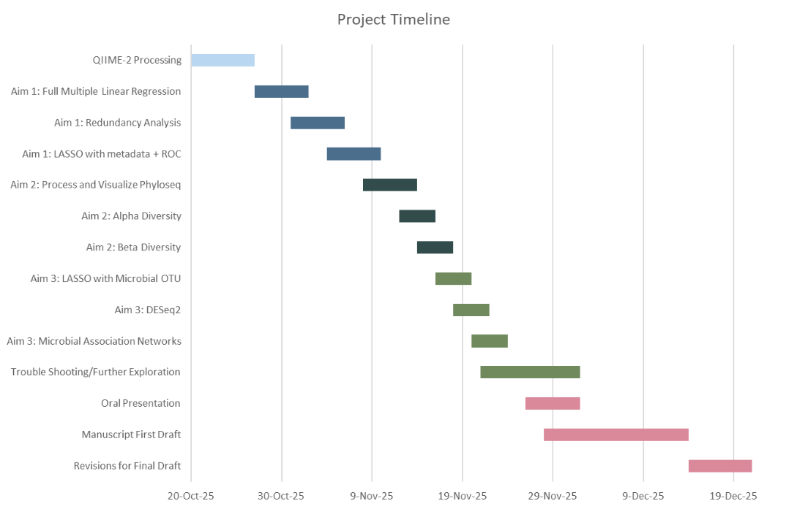

# Exploring the Interplay Between Fibre Intake, Exercise, and Gut Microbiota in Modulating Cardiovascular Health in a Westernization Context

*Authors: Rui Xiang Yu, Houria Afshar Moghaddam, Brooke Macleod, Quinlan Torstensen*

*Supervisors: Chad Poloni, Dr. Evelyn Sun, Dr. Avril Metcalfe-Roach*

This repository houses the scripts, reports, and results from the project "Exploring the Interplay Between Fibre Intake, Exercise, and Gut Microbiota in Modulating Cardiovascular Health in a Westernization Context". This project's corresponding paper will be published in UJEMI.

More information on the contents of this repository is below.

## Timeline and results



The project's report/digital lab notebook can be found in the `reports/` folder. Available formats are [Quarto MarkDown](https://github.com/xnrxng/MICB475_25W1_Team_3/blob/main/reports/team3_project_report.qmd), [PDF](https://github.com/xnrxng/MICB475_25W1_Team_3/blob/main/reports/team3_project_report.pdf), and [HTML](https://github.com/xnrxng/MICB475_25W1_Team_3/blob/main/reports/team3_project_report.html). We HIGHLY recommend the HTML format (some sections were not rendered properly in the PDF version). The HTML will require prior local downloading first.

## Team meetings

Here are the notes and the agenda for every team meeting:

| Month | Week 1 | Week 2 | Week 3 | Week 4 | Week 5 |
|:----------:|:----------:|:----------:|:----------:|:----------:|:----------:|
| October | [October 1st](https://github.com/xnrxng/MICB475_25W1_Team_3/blob/main/team_meetings/oct_1st_2025_meeting.md) | [October 8th](https://github.com/xnrxng/MICB475_25W1_Team_3/blob/main/team_meetings/oct_8th_2025_meeting.md) | [October 15th](https://github.com/xnrxng/MICB475_25W1_Team_3/blob/main/team_meetings/oct_15th_2025_meeting.md) | [October 22nd](https://github.com/xnrxng/MICB475_25W1_Team_3/blob/main/team_meetings/oct_22nd_2025_meeting.md) | [October 29th](https://github.com/xnrxng/MICB475_25W1_Team_3/blob/main/team_meetings/oct_29th_2025_meeting.md) |
| November | [November 5th](https://github.com/xnrxng/MICB475_25W1_Team_3/blob/main/team_meetings/nov_5th_2025_meeting.md) | Midterm break, NA | [November 19th](https://github.com/xnrxng/MICB475_25W1_Team_3/blob/main/team_meetings/nov_19th_2025_meeting.md) | [November 26th](https://github.com/xnrxng/MICB475_25W1_Team_3/blob/main/team_meetings/nov_26th_2025_meeting.md) | NA |
| December | [December 3rd](https://github.com/xnrxng/MICB475_25W1_Team_3/blob/main/team_meetings/dec_3rd_2025_meeting.md) | NA | NA | NA | NA |

## Reproducibility

To reproduce the results FULLY in this repository, you should have the following set up:

1.  Git clone the repository:

    ``` bash
    git clone https://github.com/xnrxng/MICB475_25W1_Team_3.git
    ```

2.  `cd` to the root of the repository.

3.  Create the conda environment:

    ``` bash
    conda env create -f environment.yml
    ```

4.  Activate the conda environment:

    ``` bash
    conda activate qiime2-amplicon-2025.4
    ```

5.  Have the FASTQ files downloaded. If you do not have them yet, you can run the following:

    ``` bash
    bash bin/0-data_download.sh
    ```

6.  To process the downloaded sequences with QIIME2, you run:

    ``` bash
    bash bin/01-qiime2_data_processing.sh
    ```

    \*Followed by:

    ``` bash
    bash bin/02-qiime2_data_filtering.sh
    ```

7.  To run the PICRUST2 analysis, create the conda environment:

    ``` bash
    conda env create -f picrust2_env.yml
    ```

    Followed by:

    ``` bash
    bash bin/03-piicrust.sh
    ```

8.  To run any Rscripts, you will have to create an R environment with:

    ``` r
    if (!require("renv", quietly = TRUE)) {
      install.packages("renv")
    }

    library(renv)

    renv::restore()
    ```

    Followed by:

    ``` r
    renv::activate()
    ```

\*IMPORTANT: please note that running `bash bin/02-qiime2_data_filtering.sh` will give you an error as line 30 expects an absolute path. Please change the absolute path to where your classifier is hosted. The classifier used in this project is SILVA version 138 99% OTUs, trained for the primer pair 515F/806R, which targets the V4 region of the 16S rRNA gene.

After this is set-up, you can re-run the R scripts using the usage specified in each one . Please note that this might be a time-consuming and memory-intensive process. We recommend starting a double-pane `tmux` session where `htop` can be run, while your CLI is running.

If you encounter any errors, have any questions or suggestions, please make a GitHub issue in the repository.
